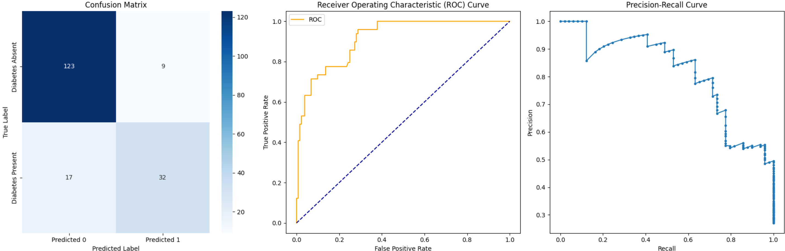
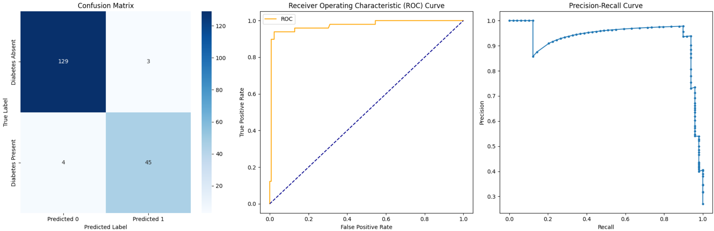
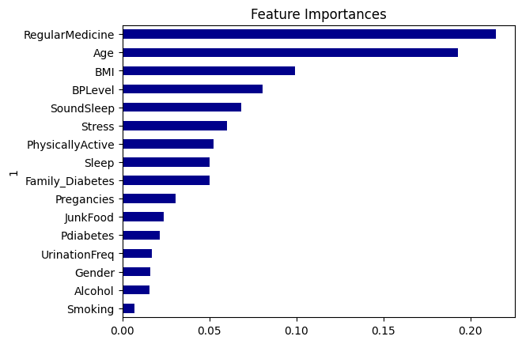
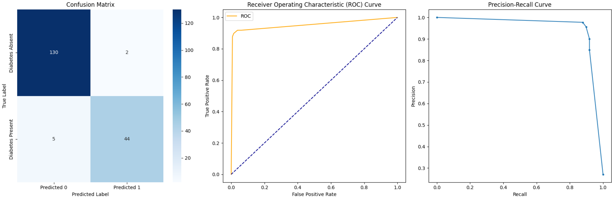
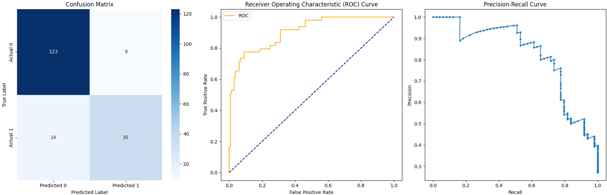
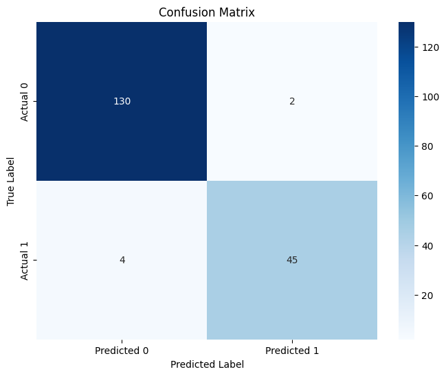
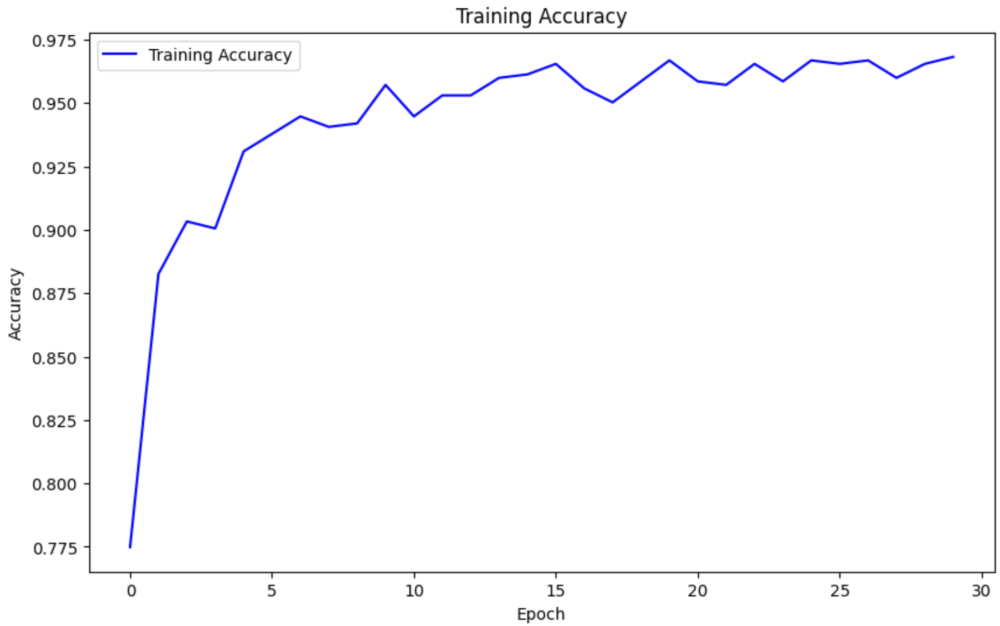
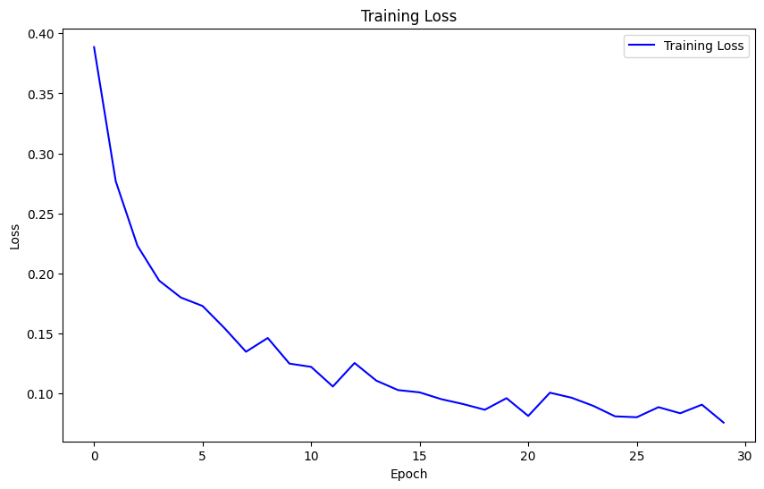

# DataDiagnostics Group
# Project Title: Development of a Diabetes Prediction Model using Machine Learning (Report)

## Contents
1. [Introduction](#1-introduction)
2. [Dataset](#2-dataset)
3. [Data Pre-Processing](#3-data-pre-processing)
4. [Model Building and Tuning](#4-model-building-and-tuning-and-evaluation)
5. [Results](#5-results)
6. [Conclusion](#6-conclusion)
7. [References](#7-references)

## 1. Introduction

According to the International Diabetes Federation, approximately 537 million adults (20-79 years) are living with diabetes. Around 90% of diabetes cases are Type 2, influenced by factors like economy, age, environment, and lifestyles. Preventive actions and early diagnosis can help mitigate diabetes impact. The project aims to predict Type 2 diabetes risk using machine learning algorithms based on lifestyle and family background. These accurate algorithms are essential in healthcare for risk assessment.

## 2. Dataset

The [Kaggle](https://kaggle.com) [dataset](https://www.kaggle.com/datasets/tigganeha4/diabetes-dataset-2019) utilised in this project was curated by Neha Prerna Tigga and Dr. Shruti Garg from the Department of Computer Science and Engineering at Birla Institute of Technology, Mesra, for research purposes only and is not intended for commercial use. An [article](https://www.sciencedirect.com/science/article/pii/S1877050920308024) detailing the implementation of this dataset was published on [ScienceDirect](https://www.sciencedirect.com), providing further information.

In the original study, Random Forest was found to be most accurate. In this project, the following machine learning models were chosen for testing:
   - Logistic Regression
   - Random Forest
   - Decision Tree
   - Support Vector Machines (SVM)
   - K-Nearest Neighbors (KNN)

In addition to the above models, Neural Network model was also employed to explore whether further improvements in accuracy could be achieved.

The following are the parameters of the raw dataset in Kaggle:
   |  | Parameter | Header | Instances |
   | ---- | ---- | ---- | ---- |
   | 1. | **Age** | Age | less than 40, 40-49, 50-59, 60 or older |
   | 2. | **Gender** | Gender | male, female |
   | 3. | **Family history with diabetes** | Family_Diabetes | yes, no |
   | 4. | **Diagnosed with high blood pressure** | highBP | yes, no |
   | 5. | **Walk/run/physically active** | PhysicallyActive | none, less than half an hour, more than half an hour, one hour or more |
   | 6. | **BMI** | BMI | numeric |
   | 7. | **Smoking** | Smoking | yes, no |
   | 8. | **Alcohol consumption** | Alcohol | yes, no |
   | 9. | **Hours of sleep** | Sleep | numeric |
   | 10. | **Hours of sound sleep** | SoundSleep | numeric |
   | 11. | **Regular intake of medicine?** | RegularMedicine | yes, no |
   | 12. | **Junk food consumption** | JunkFood | yes, no |
   | 13. | **Stress** | Stress | not at all, sometimes, often, always |
   | 14. | **Blood pressure level** | BPLevel | low, normal, high |
   | 15. | **Number of pregnancies** | Pregancies| numeric |
   | 16. | **Gestational diabetes** | Pdiabetes| yes, no |
   | 17. | **Frequency of urination** | UriationFreq| not much, quite much |
   | 18. | **Diabetic?** | Diabetic | diabetic, non-diabetic |

- **Size of the dataset:** 952

## 3. Data Pre-Processing

**Data Cleaning and Pre-Processing:**

1. **Parameter Renaming:**
   - `Family_Diabetes` renamed to `FamilyDiabetes` (for consistency)
   - `Pdiabetes` renamed to `GDiabetes` (for clarity in meaning)
   - `Pregancies` and `UriationFreq` renamed to `Pregnancies` and `UrinationFreq`, respectively (for spelling accuracy)

2. **Handling Redundant Columns:**
   - `highBP` was dropped due to overlap with `BPLevel`. This reduces the possibility of conflicting information (e.g., 'yes' in `highBP` and 'normal' in `BPLevel`).

3. **Missing Value Imputation:**
   - Rows containing missing values were removed entirely. This resulted in a reduced dataset size of 905 entries.

4. **Encoding Categorical Parameters:**
   - The following **binary categorical parameters** were converted to `0` and `1`: `Gender`, `FamilyDiabetes`, `Smoking`, `Alcohol`, `RegularMedicine`, `GDiabetes`, `Diabetic`
   - The following **ordinal categorical parameters** were converted to numerical values: `Age`, `PhysicallyActive`, `JunkFood`, `Stress`, `BPLevel`, `UrinationFreq`
   - This conversion allows these parameters to be used in machine learning algorithms that require numerical features.

5. **Datasets Preview:**
   - Raw dataset is stored in [`resources/diabetes_dataset__2019.csv`](resources/diabetes_dataset__2019.csv).
   - Processed dataset is stored in [`resources/processed_dataset.csv`](resources/processed_dataset.csv).

**Data Splitting:** 
- Defined the target `Diabetic` and feature parameters and split the data into subsets ready for the training and testing of models.
   
**Feature scaling:**
- Standardised numerical features using Z-score normalisation.
   
**Exploratory Data Analysis (EDA):**
   - **Visualising distributions of numerical parameters:** Utilised histograms and box plots to explore the distribution of features such as glucose level, blood pressure, BMI, etc.
   - **Correlation analysis:** Calculated Pearson correlation coefficients between features to identify potential correlations with the target parameter (diabetes).
   

## 4. Model Building and Tuning and Evaluation

**Model Building:**
   - **Logistic Regression:** Trained a logistic regression model as a baseline model.
   - **Random Forest:** Implemented a random forest classifier to capture non-linear relationships between features.
   - **Decision Tree:** Built a decision tree classifier to understand the decision-making process.
   - **Support Vector Machine (SVM):** Employed SVM with different kernels (linear, polynomial, and radial basis function) to find the best separating hyperplane. In this project, a linear kernel was selected due to its computational efficiency. It is important, however, to note that other kernels may help yield better accuracy.
   - **K-Nearest Neighbors (KNN):** Implemented KNN to classify data points based on the majority class of their nearest neighbours.
   - **Neural Network:** Constructed a neural network with multiple hidden layers using TensorFlow.

**Hyperparameter Tuning:**
   - Utilised **GridSearchCV** to tune hyperparameters for Logistic Regression, Random Forest, Decision Tree, SVM and KNN.
   
**Neural Network Optimisation:**
   - Used **Keras Tuner** to perform hyperparameter optimisation for the Neural Network model, including the number of hidden layers, neurons per layer, activation functions, and learning rate.

**Model Evaluation:**
   - Confusion matrix: Analysed true positive, false positive, true negative, and false negative predictions.
   - Metrics: Calculated accuracy, precision, recall, F1-score to assess model performance.
   - ROC curve and AUC-ROC: Plotted the Receiver Operating Characteristic (ROC) curve and calculated the Area Under the Curve (AUC) to evaluate model discrimination.
   - Precision-recall curve: Visualised the trade-off between precision and recall for different threshold values.
   - Performance of different models was compared and their strengths and weaknesses were discussed.

## 5. Results

| Model | Accuracy | Precision (Diabetes Absent) | Precision (Diabetes Present) | Recall (Diabetes Absent) | Recall (Diabetes Present) | F1-score (Diabetes Absent) | F1-score (Diabetes Present) |
| --- | --- | --- | --- | --- | --- | --- | --- | 
| **Logistic Regression** | 85.64% | 88% | 78% | 93% | 65% | 90% | 71% |
| **Random Forest** | 96.13% | 97% | 94% | 98% | 92% | 97% | 93% |
| **Decision Tree** | 96.13% | 96% | 96% | 98% | 90% | 97% | 93% |
| **SVM** | 87.29% | 90% | 80% | 93% | 71% | 91% | 75% |
| **KNN** | 96.13% | 97% | 94% | 98% | 92% | 97% | 93% |
| **Neural Network (optimised)** | 97.24% | 97% | 98% | 99% | 92% | 98% | 95% |

### **Hyperparameter Tuning with GridSearchCV**

| Model | Best Parameters | Best Accuracy |
| --- | --- | --- |
| **Logistic Regression** | {'C': 10, 'penalty': 'l2', 'solver': 'newton-cg'} | 86.33% |
| **Random Forest** | {'max_depth': None, 'min_samples_split': 2, 'n_estimators': 200} | 94.89% |
| **Decision Tree** | {'max_depth': 20, 'min_samples_leaf': 1, 'min_samples_split': 2} | 94.75% |
| **SVM** | {'C': 10, 'gamma': 'scale', 'kernel': 'poly'} | 93.51% |
| **KNN** | {'algorithm': 'ball_tree', 'n_neighbors': 3, 'weights': 'distance'} | 95.30% |

### **Results: Logistic Regression**

### **Results: Random Forest**

#### **Results: Random Forest - Feature Importances**

### **Results: Decision Tree**

### **Results: SVM**

### **Results: KNN**

### **Results: Neural Network**

#### **Results: Neural Network - Training Accuracy**

#### **Results: Neural Network - Training Loss**

## 6. Conclusion

The exploration into developing a diabetes prediction model using machine learning techniques has provided valuable insights. The Neural Network model emerges as the most accurate and balanced performer in predicting Type 2 Diabetes, closely followed by Random Forest, Decision Tree, and KNN, which also demonstrate promising results. However, SVM and Logistic Regression exhibit comparatively lower accuracy and performance. 

Through analysis with Random Forest, we identified the top three features influencing predictions: RegularMedicine, Age, and BMI.

Hyperparameter tuning using GridSearchCV notably enhanced the performance of SVM and marginally improved Logistic Regression, although for Decision Tree, Random Forest, and KNN, the tuning process showed diminishing returns, with no significant improvements observed.

Considering computational resources, the Neural Network model stands out as the recommended choice for accurate and reliable diabetes prediction, with Random Forest, Decision Tree, and KNN remaining viable alternatives due to their balanced accuracy and efficiency.

Additionally, the development of a user-friendly web application enhances accessibility to the predictive model, allowing users to input health parameters and receive diabetes risk predictions along with explanatory insights. This web application provides an intuitive interface for users, further contributing to the dissemination of the predictive tool in practical healthcare settings.

## 7. References

- **Dataset - Kaggle:** [https://www.kaggle.com/datasets/tigganeha4/diabetes-dataset-2019](https://www.kaggle.com/datasets/tigganeha4/diabetes-dataset-2019)
- **Research Paper for the Dataset:** Tigga, N. P., & Garg, S. (2020). Prediction of Type 2 Diabetes using Machine Learning Classification Methods. Procedia Computer Science, 167, 706-716. DOI: [https://doi.org/10.1016/j.procs.2020.03.336](https://doi.org/10.1016/j.procs.2020.03.336)
- **Diabetes Facts & Figures - International Diabetes Federation:** [https://idf.org/about-diabetes/diabetes-facts-figures/](https://idf.org/about-diabetes/diabetes-facts-figures/)
- **Diabetes - NHS:** [https://www.nhs.uk/conditions/diabetes/](https://www.nhs.uk/conditions/diabetes/)
